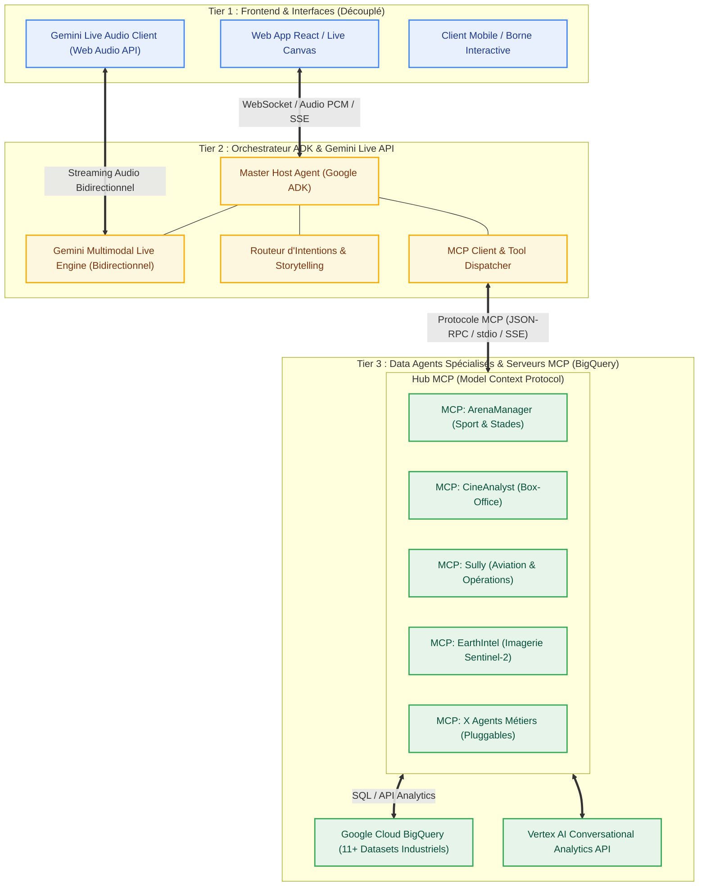

# 🏛️ Architecture 3 Tiers Découplée : Orchestrateur ADK Gemini Live & Data Agents MCP

Ce document présente la vision architecturale et la feuille de route pour faire évoluer **Talk to Data** vers une architecture d'entreprise modulaire, découplée et hautement réutilisable.

---

## 🎯 1. Schéma Global des 3 Tiers



---

## 🏗️ 2. Détail des 3 Tiers

### 🖥️ Tier 1 : Frontend UI & Expérience Découplée
* **Rôle** : Restitution visuelle et capture audio (microphone Web Audio API, Canvas fluide, cartes décisionnelles).
* **Découplage Total** :
  * Le Frontend ne connaît aucun nom de dataset BigQuery, aucune table SQL, et n'a aucune logique de routing codée en dur.
  * Il se contente de se connecter au flux WebSocket / Audio de l'Orchestrateur Tier 2.
  * Tout nouveau frontend (ex: application mobile Flutter, intégration Slack, borne d'accueil physique) peut se brancher sur le même backend sans modification.

---

### 🎙️ Tier 2 : Orchestrateur Central Google ADK & Gemini Live API
* **Rôle** : C'est le **"Présentateur Virtuel / Maître de Cérémonie"**.
* **Technologies Clés** :
  * **Google ADK (Agent Development Kit)** : Framework modulaire pour orchestrer les agents, sous-agents et appels d'outils.
  * **Gemini Multimodal Live API** : Streaming audio bidirectionnel ultra-faible latence (WebSockets, voix native, interruption naturelle par la voix).
  * **Speech Sanitizer & Storytelling Actif** : L'hôte formule une narration humaine en français parfait pendant que les requêtes de données tournent en sous-main.
* **Fonctionnement du Tool Use** :
  * Lorsqu'un utilisateur pose une question (ex: *"Quel est le taux d'occupation des loges VIP à l'Arena ?"*), l'Orchestrateur détecte l'intention et invoque l'outil MCP correspondant (`mcp_arena_manager.query`).

---

### 📦 Tier 3 : Data Agents Packagés en MCP (Model Context Protocol)
* **Rôle** : Fournir l'expertise métier et l'accès direct aux données BigQuery.
* **Avantages du packaging MCP** :
  * **Indépendance & Réutilisabilité** : Chaque agent devient un serveur MCP standardisé, consommable non seulement par notre orchestrateur ADK, mais aussi par Cursor, Claude Code, Gemini Enterprise ou d'autres copilotes.
  * **Hot-Swapping (Ajout / Retrait sans casser le système)** : Passer de 11 à 20 ou 5 agents se fait par simple configuration déclarative d'une liste de serveurs MCP dans le Tier 2.
  * **Isolation des Requêtes** : Chaque agent MCP encapsule ses schémas, ses prompts système, ses tables BigQuery et ses vérifications de sécurité SQL.

---

## 🛠️ 3. Structure de Code Cible

```text
talktodata/
├── backend/
│   ├── orchestrator/                 # TIER 2 : Orchestrateur ADK & Gemini Live
│   │   ├── host_agent.py             # Agent Hôte Central (Google ADK)
│   │   ├── gemini_live_session.py    # Gestionnaire WebSocket Gemini Live Audio
│   │   ├── prompt_templates.py       # Directives Storytelling & Personas
│   │   └── mcp_client.py             # Client MCP découplé
│   │
│   ├── mcp_servers/                  # TIER 3 : Data Agents Packagés en MCP
│   │   ├── common/                   # Helpers BigQuery & Vertex Analytics
│   │   │   ├── bq_client.py
│   │   │   └── sanitizer.py
│   │   ├── arena_manager/            # Serveur MCP ArenaManager
│   │   │   ├── server.py
│   │   │   └── tools.py
│   │   ├── cine_analyst/             # Serveur MCP CineAnalyst
│   │   │   ├── server.py
│   │   │   └── tools.py
│   │   └── [autres_agents_mcp]...
│   │
│   └── main.py                       # Point d'entrée FastAPI / WebSocket Gateway
│
└── frontend/                         # TIER 1 : Client UI Découplé
    ├── src/
    │   ├── hooks/
    │   │   ├── useGeminiLiveAudio.js # Streaming Audio WebSockets vers Tier 2
    │   │   └── useAgentState.js
    │   └── components/               # Canvas, Orbe 3D, Cartes Métier
```

---

## 💻 4. Exemples d'Implémentation Conceptuelle

### Tier 3 : Data Agent MCP (Exemple `arena_manager`)

```python
# backend/mcp_servers/arena_manager/server.py
from mcp.server.fastmcp import FastMCP
from google.cloud import bigquery

mcp = FastMCP("ArenaManager Data Agent")
bq_client = bigquery.Client(project="data-agents-by-industry")

@mcp.tool()
async def query_arena_kpis(question: str) -> dict:
    """Interroge les KPIs d'occupation, billetterie et concessions des stades et arènes."""
    # Appel vers Vertex Conversational Analytics ou BigQuery SQL optimisé
    sql = """
        SELECT stadium_name, occupancy_rate, vip_lounge_revenue
        FROM `data-agents-by-industry.arena_manager_ds.stadium_kpis`
        ORDER BY occupancy_rate DESC LIMIT 5
    """
    query_job = bq_client.query(sql)
    results = [dict(row) for row in query_job.result()]
    return {
        "sector": "Sport & Événementiel",
        "data": results,
        "summary": "5 infrastructures analysées avec succès."
    }

if __name__ == "__main__":
    mcp.run()
```

---

### Tier 2 : Orchestrateur ADK & Gemini Live Dispatcher

```python
# backend/orchestrator/host_agent.py
from google.genai import types
from google.genai.agents import Agent

HOST_SYSTEM_INSTRUCTION = """
Tu es l'Agent Hôte Virtuel de la démonstration Talk to Data.
Tu accueilles chaleureusement l'utilisateur en français.
Lorsque l'utilisateur te pose une question sur un secteur (sport, cinéma, santé, aéronautique...),
utilise les outils MCP à ta disposition pour interroger les données BigQuery.
Pendant le temps d'exécution, maintiens une conversation naturelle et agréable.
Ne lis jamais de JSON brut ou de code SQL technique à la voix : traduis toujours en synthèse d'affaires élégante.
"""

# Définition de l'Agent Hôte ADK avec injection des outils MCP
host_agent = Agent(
    model="gemini-2.0-flash-exp",
    system_instruction=HOST_SYSTEM_INSTRUCTION,
    tools=[
        # Outils MCP dynamiquement chargés depuis Tier 3
    ]
)
```

---

## 🚀 5. Plan de Migration Progressif (Roadmap)

| Phase | Objectif | Livrables Clés |
| :--- | :--- | :--- |
| **Étape 1** | **Packaging MCP Tier 3** | Transformer les 11 agents BigQuery existants en micro-serveurs MCP standardisés. |
| **Étape 2** | **Orchestrateur ADK Tier 2** | Implémenter l'Agent Hôte avec le SDK Google ADK et connecter les outils MCP. |
| **Étape 3** | **Streaming Gemini Live Audio** | Intégrer l'API Gemini Multimodal Live pour la voix bidirectionnelle ultra-fluide. |
| **Étape 4** | **Branchement Frontend Tier 1** | Connecter l'interface React existante au flux WebSocket / Live de l'Orchestrateur. |
