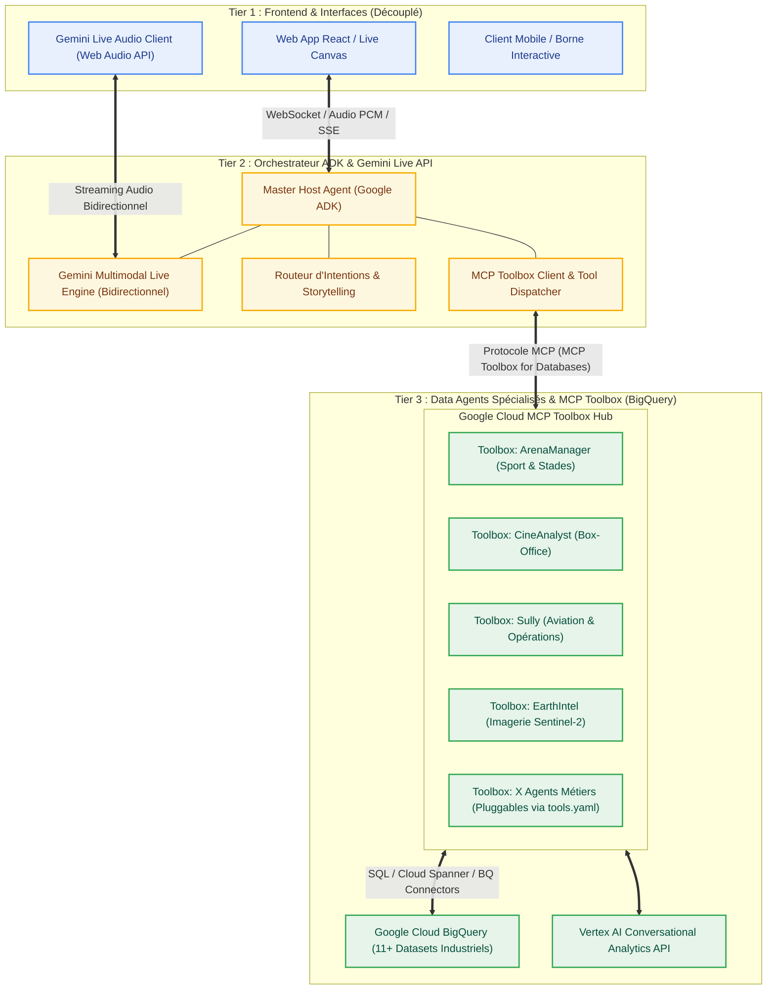

# 🏛️ Architecture 3 Tiers Découplée : Orchestrateur ADK Gemini Live & MCP Toolbox (BigQuery)

Ce document présente la vision architecturale et la feuille de route pour faire évoluer **Talk to Data** vers une architecture d'entreprise modulaire, découplée et standardisée avec **Google ADK** et **MCP Toolbox**.

---

## 🎯 1. Schéma Global des 3 Tiers



---

## 🏗️ 2. Détail des 3 Tiers

### 🖥️ Tier 1 : Frontend UI & Expérience Découplée
* **Rôle** : Restitution visuelle et capture audio (microphone Web Audio API, Canvas fluide, cartes décisionnelles).
* **Découplage Total** :
  * Le Frontend ne connaît aucun nom de dataset BigQuery, aucune table SQL, et n'a aucune logique de routing codée en dur.
  * Il se contente de se connecter au flux WebSocket / Audio de l'Orchestrateur Tier 2.
  * Tout nouveau frontend (ex: application mobile Flutter, intégration Slack, borne d'accueil physique) peut se brancher sur le même backend sans modification.

---

### 🎙️ Tier 2 : Orchestrateur Central Google ADK & Gemini Live API
* **Rôle** : C'est le **"Présentateur Virtuel / Maître de Cérémonie"**.
* **Technologies Clés** :
  * **Google ADK (Agent Development Kit)** : Framework modulaire pour orchestrer les agents, sous-agents et appels d'outils.
  * **Gemini Multimodal Live API** : Streaming audio bidirectionnel ultra-faible latence (WebSockets, voix native, interruption naturelle par la voix).
  * **Speech Sanitizer & Storytelling Actif** : L'hôte formule une narration humaine en français parfait pendant que les requêtes de données tournent en sous-main.
* **Intégration MCP Toolbox** :
  * L'Orchestrateur ADK charge nativement le catalogue d'outils exposé par **MCP Toolbox** pour interroger les bases de données.

---

### 📦 Tier 3 : Data Agents Packagés avec MCP Toolbox
* **Rôle** : Fournir l'expertise métier et l'accès direct aux données BigQuery via le framework standard **MCP Toolbox (Toolbox for Databases)**.
* **Avantages du packaging MCP Toolbox** :
  * **Configuration Déclarative (`tools.yaml`)** : Définition propre des outils, requêtes paramétrées, autorisations IAM et schémas BigQuery sans boilerplate.
  * **Indépendance & Réutilisabilité** : Chaque boîte à outils devient un serveur MCP standardisé, consommable directement par l'orchestrateur ADK, Gemini Enterprise, Cursor, ou Claude Code.
  * **Hot-Swapping (Ajout / Retrait sans casser le système)** : Passer de 11 à 20 ou 5 agents se fait par simple ajout déclaratif d'une boîte à outils dans la configuration Toolbox.
  * **Sécurité & Performance** : Gestion native de l'authentification Google Cloud ADC, pooling de connexions et sanitisation des entrées SQL.

---

## 🛠️ 3. Structure de Code Cible avec MCP Toolbox

```text
talktodata/
├── backend/
│   ├── orchestrator/                 # TIER 2 : Orchestrateur ADK & Gemini Live
│   │   ├── host_agent.py             # Agent Hôte Central (Google ADK)
│   │   ├── gemini_live_session.py    # Gestionnaire WebSocket Gemini Live Audio
│   │   ├── prompt_templates.py       # Directives Storytelling & Personas
│   │   └── toolbox_client.py         # Client MCP Toolbox
│   │
│   ├── mcp_toolbox/                  # TIER 3 : MCP Toolbox for BigQuery
│   │   ├── tools.yaml                # Définition déclarative des outils BigQuery
│   │   ├── server.py                 # Serveur d'outils MCP Toolbox
│   │   └── configs/                  # Configurations spécifiques par agent
│   │       ├── arena_manager.yaml
│   │       ├── cine_analyst.yaml
│   │       ├── sully.yaml
│   │       └── earth_intel.yaml
│   │
│   └── main.py                       # Point d'entrée FastAPI / WebSocket Gateway
│
└── frontend/                         # TIER 1 : Client UI Découplé
    ├── src/
    │   ├── hooks/
    │   │   ├── useGeminiLiveAudio.js # Streaming Audio WebSockets vers Tier 2
    │   │   └── useAgentState.js
    │   └── components/               # Canvas, Orbe 3D, Cartes Métier
```

---

## 💻 4. Exemples d'Implémentation Conceptuelle

### Tier 3 : Configuration Déclarative MCP Toolbox (`tools.yaml`)

```yaml
# backend/mcp_toolbox/tools.yaml
sources:
  my-bigquery-source:
    kind: bigquery
    project: data-agents-by-industry
    location: global

tools:
  arena_manager_agent:
    kind: bigquery-conversational-analytics
    source: my-bigquery-source
    agent_id: "arena-manager-agent"
    dataset: "arena_manager_ds"
    description: "Gestionnaire de Stades : analyse les taux d'occupation, revenus VIP et flux de spectateurs."

  cine_analyst_agent:
    kind: bigquery-conversational-analytics
    source: my-bigquery-source
    agent_id: "cine-analyst-agent"
    dataset: "cine_analyst_ds"
    description: "Analyste Box-Office : analyse la rentabilité, entrées en salles et ROI des films."
```

---

### Tier 2 : Orchestrateur ADK & Gemini Live WebSocket (`backend/orchestrator/`)

```python
# backend/orchestrator/gemini_live_session.py
from google import genai
from google.genai import types
from mcp_toolbox.toolbox_client import toolbox_client
from .host_agent import HOST_SYSTEM_INSTRUCTION

# Configuration Live Bidi-Streaming avec Synthèse Vocale 24kHz
config = types.LiveConnectConfig(
    response_modalities=[types.LiveModality.AUDIO],
    speech_config=types.SpeechConfig(
        voice_config=types.VoiceConfig(
            prebuilt_voice_config=types.PrebuiltVoiceConfig(voice_name="Aoede")
        )
    ),
    system_instruction=types.Content(
        parts=[types.Part.from_text(text=HOST_SYSTEM_INSTRUCTION)]
    ),
    tools=toolbox_client.get_adk_function_declarations()
)

# Connexion asynchrone WebSocket avec cascade de résilience
async with client.aio.live.connect(model="gemini-live-2.5-flash-native-audio", config=config) as session:
    # Traitement bidi-streaming : audio PCM entrant 16kHz, audio sortant 24kHz,
    # détection d'interruption VAD (Barge-in), et exécution streaming des outils MCP BigQuery.
    pass
```

---

## 🚀 5. État d'Implémentation & Production

| Phase | Objectif | Statut | Livrables Réalisés |
| :--- | :--- | :--- | :--- |
| **Tier 3** | **Packaging MCP Toolbox** | ✅ **Opérationnel** | 11 Data Agents BigQuery exposés via `mcp_toolbox.toolbox_client` et testables en direct. |
| **Tier 2** | **Orchestrateur ADK & Host Agent** | ✅ **Opérationnel** | `ADKHostAgent` avec base de connaissances des 11 secteurs (`AGENT_KNOWLEDGE_BASE`), banques de thinking dynamiques, et filtre d'élocution exécutif. |
| **Tier 2** | **Streaming Gemini Live Audio** | ✅ **Opérationnel** | WebSocket plein duplex `/ws/live`, cascade de modèles native-audio (`gemini-live-2.5-flash-native-audio` $\rightarrow$ `gemini-2.0-flash-exp`), Barge-in instantané, audio PCM 24kHz. |
| **Tier 1** | **Interface UI Découplée** | ✅ **Opérationnel** | Frontend React avec `useGeminiLive` (Web Audio API, filtre passe-bas 9.5 kHz anti-clipping), `useAgentChat` et commutation d'agents 100% mains libres. |

