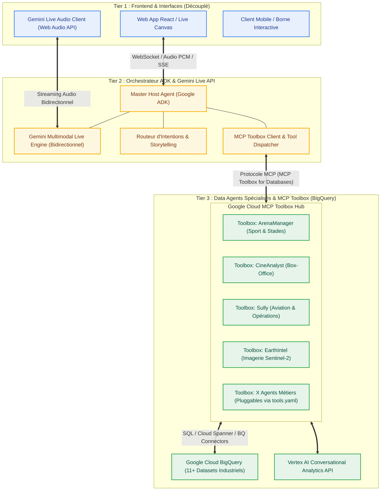

# 🏛️ Architecture 3 Tiers Découplée : Orchestrateur ADK Gemini Live & MCP Toolbox (BigQuery)

Ce document présente la vision architecturale et la feuille de route pour faire évoluer **Talk to Data** vers une architecture d'entreprise modulaire, découplée et standardisée avec **Google ADK** et **MCP Toolbox**.

---

## 🎯 1. Schéma Global des 3 Tiers



---

## 🏗️ 2. Détail des 3 Tiers

### 🖥️ Tier 1 : Frontend UI & Expérience Découplée
* **Rôle** : Restitution visuelle et capture audio (microphone Web Audio API, Canvas fluide, cartes décisionnelles).
* **Découplage Total** :
  * Le Frontend ne connaît aucun nom de dataset BigQuery, aucune table SQL, et n'a aucune logique de routing codée en dur.
  * Il se contente de se connecter au flux WebSocket / Audio de l'Orchestrateur Tier 2.
  * Tout nouveau frontend (ex: application mobile Flutter, intégration Slack, borne d'accueil physique) peut se brancher sur le même backend sans modification.

---

### 🎙️ Tier 2 : Orchestrateur Central Google ADK & Gemini Live API
* **Rôle** : C'est le **"Présentateur Virtuel / Maître de Cérémonie"**.
* **Technologies Clés** :
  * **Google ADK (Agent Development Kit)** : Framework modulaire pour orchestrer les agents, sous-agents et appels d'outils.
  * **Gemini Multimodal Live API** : Streaming audio bidirectionnel ultra-faible latence (WebSockets, voix native, interruption naturelle par la voix).
  * **Speech Sanitizer & Storytelling Actif** : L'hôte formule une narration humaine en français parfait pendant que les requêtes de données tournent en sous-main.
* **Intégration MCP Toolbox** :
  * L'Orchestrateur ADK charge nativement le catalogue d'outils exposé par **MCP Toolbox** pour interroger les bases de données.

---

### 📦 Tier 3 : Data Agents Packagés avec MCP Toolbox
* **Rôle** : Fournir l'expertise métier et l'accès direct aux données BigQuery via le framework standard **MCP Toolbox (Toolbox for Databases)**.
* **Avantages du packaging MCP Toolbox** :
  * **Configuration Déclarative (`tools.yaml`)** : Définition propre des outils, requêtes paramétrées, autorisations IAM et schémas BigQuery sans boilerplate.
  * **Indépendance & Réutilisabilité** : Chaque boîte à outils devient un serveur MCP standardisé, consommable directement par l'orchestrateur ADK, Gemini Enterprise, Cursor, ou Claude Code.
  * **Hot-Swapping (Ajout / Retrait sans casser le système)** : Passer de 11 à 20 ou 5 agents se fait par simple ajout déclaratif d'une boîte à outils dans la configuration Toolbox.
  * **Sécurité & Performance** : Gestion native de l'authentification Google Cloud ADC, pooling de connexions et sanitisation des entrées SQL.

---

## 🛠️ 3. Structure de Code Cible avec MCP Toolbox

```text
talktodata/
├── backend/
│   ├── orchestrator/                 # TIER 2 : Orchestrateur ADK & Gemini Live
│   │   ├── host_agent.py             # Agent Hôte Central (Google ADK)
│   │   ├── gemini_live_session.py    # Gestionnaire WebSocket Gemini Live Audio
│   │   ├── prompt_templates.py       # Directives Storytelling & Personas
│   │   └── toolbox_client.py         # Client MCP Toolbox
│   │
│   ├── mcp_toolbox/                  # TIER 3 : MCP Toolbox for BigQuery
│   │   ├── tools.yaml                # Définition déclarative des outils BigQuery
│   │   ├── server.py                 # Serveur d'outils MCP Toolbox
│   │   └── configs/                  # Configurations spécifiques par agent
│   │       ├── arena_manager.yaml
│   │       ├── cine_analyst.yaml
│   │       ├── sully.yaml
│   │       └── earth_intel.yaml
│   │
│   └── main.py                       # Point d'entrée FastAPI / WebSocket Gateway
│
└── frontend/                         # TIER 1 : Client UI Découplé
    ├── src/
    │   ├── hooks/
    │   │   ├── useGeminiLiveAudio.js # Streaming Audio WebSockets vers Tier 2
    │   │   └── useAgentState.js
    │   └── components/               # Canvas, Orbe 3D, Cartes Métier
```

---

## 💻 4. Exemples d'Implémentation Conceptuelle

### Tier 3 : Configuration Déclarative MCP Toolbox (`tools.yaml`)

```yaml
# backend/mcp_toolbox/tools.yaml
sources:
  bigquery_source:
    kind: bigquery
    project: data-agents-by-industry

tools:
  query_arena_stadiums:
    kind: bigquery-sql
    source: bigquery_source
    description: "Interroge les taux d'occupation et revenus VIP des stades pour l'agent ArenaManager."
    statement: |
      SELECT stadium_name, occupancy_rate, vip_lounge_revenue
      FROM `data-agents-by-industry.arena_manager_ds.stadium_kpis`
      WHERE occupancy_rate >= @min_occupancy
      ORDER BY occupancy_rate DESC
      LIMIT 10
    parameters:
      - name: min_occupancy
        type: float64
        description: "Taux d'occupation minimal (ex: 0.70)"

  query_cine_boxoffice:
    kind: bigquery-sql
    source: bigquery_source
    description: "Analyse les performances box-office et retours sur investissement cinéma pour CineAnalyst."
    statement: |
      SELECT title, box_office_revenue, roi_percentage
      FROM `data-agents-by-industry.cine_analyst_ds.box_office_rankings`
      ORDER BY box_office_revenue DESC
      LIMIT 10
```

---

### Tier 2 : Orchestrateur ADK avec Chargement des Outils MCP Toolbox

```python
# backend/orchestrator/host_agent.py
from google.genai import types
from google.genai.agents import Agent
from google.cloud.toolbox import ToolboxClient

# Connexion au serveur MCP Toolbox local ou distant
toolbox = ToolboxClient(config_path="backend/mcp_toolbox/tools.yaml")
toolbox_tools = toolbox.get_tools()

HOST_SYSTEM_INSTRUCTION = """
Tu es l'Agent Hôte Virtuel de la démonstration Talk to Data.
Tu accueilles chaleureusement l'utilisateur en français.
Lorsque l'utilisateur te pose une question sur un secteur (sport, cinéma, santé, aéronautique...),
utilise les outils MCP Toolbox à ta disposition pour interroger les bases BigQuery.
Pendant le temps d'exécution, maintiens une conversation naturelle et agréable.
Ne lis jamais de JSON brut ou de code SQL technique à la voix : traduis toujours en synthèse d'affaires élégante.
"""

# Définition de l'Agent Hôte ADK avec injection native des outils MCP Toolbox
host_agent = Agent(
    model="gemini-2.0-flash-exp",
    system_instruction=HOST_SYSTEM_INSTRUCTION,
    tools=toolbox_tools
)
```

---

## 🚀 5. Plan de Migration Progressif (Roadmap)

| Phase | Objectif | Livrables Clés |
| :--- | :--- | :--- |
| **Étape 1** | **Packaging MCP Toolbox (Tier 3)** | Définir les `tools.yaml` pour les 11 jeux de données BigQuery avec MCP Toolbox. |
| **Étape 2** | **Orchestrateur ADK (Tier 2)** | Créer l'Agent Hôte central avec Google ADK et charger les outils Toolbox. |
| **Étape 3** | **Streaming Gemini Live Audio** | Brancher la session WebSocket Gemini Multimodal Live API pour la voix bidirectionnelle. |
| **Étape 4** | **Branchement Frontend (Tier 1)** | Connecter l'interface React au flux WebSocket / Audio de l'Orchestrateur. |
