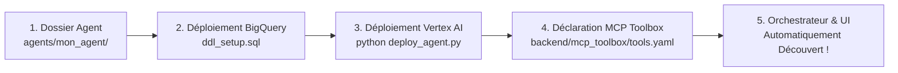

# 📖 Guide Complet : Créer, Déployer et Connecter un Data Agent BigQuery

Ce guide explique pas à pas comment **créer un nouvel agent sectoriel**, le **déployer sur Google Cloud Vertex AI**, et le **connecter automatiquement à MCP Toolbox et à l'Agent Orchestrateur Central**.

---

## 🏗️ Vue d'Ensemble du Cycle de Vie d'un Agent



---

## 🚀 Étape 1 : Créer le Dossier de l'Agent

Créez un nouveau dossier dans `agents/` avec le nom de votre agent (en `snake_case`) :

```bash
mkdir -p agents/mon_nouvel_agent/data
```

Chaque agent est constitué de 3 fichiers clés :

```text
agents/mon_nouvel_agent/
├── ddl_setup.sql            # 1. Création du dataset et des tables BigQuery
├── agent_payload.json       # 2. Configuration Vertex AI (Prompts, Schémas, Exemples)
└── deploy_agent.py          # 3. Script Python de déploiement automatique sur GCP
```

---

## 🗄️ Étape 2 : Définir les Données BigQuery (`ddl_setup.sql`)

Dans `agents/mon_nouvel_agent/ddl_setup.sql`, créez le dataset et les tables nécessaires :

```sql
-- Création du dataset
CREATE SCHEMA IF NOT EXISTS `data-agents-by-industry.mon_secteur_ds`
OPTIONS(location="EU");

-- Table principale
CREATE OR REPLACE TABLE `data-agents-by-industry.mon_secteur_ds.kpis_principaux` (
    id STRING,
    entite_nom STRING,
    valeur_kpi FLOAT64,
    date_mesure DATE
);
```

Exécutez ce script dans BigQuery via la console ou en ligne de commande :
```bash
bq query --use_legacy_sql=false < agents/mon_nouvel_agent/ddl_setup.sql
```

---

## 📝 Étape 3 : Configurer l'Agent Vertex AI (`agent_payload.json`)

Dans `agents/mon_nouvel_agent/agent_payload.json`, configurez les métadonnées et le prompt de l'agent :

```json
{
  "name": "projects/data-agents-by-industry/locations/global/dataAgents/mon-nouvel-agent",
  "displayName": "MonAgent - Secteur & Métier",
  "description": "Copilote décisionnel spécialisé dans l'analyse de...",
  "dataAnalyticsAgent": {
    "publishedContext": {
      "systemInstruction": "Tu es un expert métier pour l'analyse de... Tu réponds toujours en français professionnel et clair.",
      "datasources": [
        {
          "bigqueryTableReference": {
            "projectId": "data-agents-by-industry",
            "datasetId": "mon_secteur_ds",
            "tableId": "kpis_principaux"
          }
        }
      ],
      "exampleQueries": [
        {
          "naturalLanguageQuestion": "Quelles sont les 5 entités ayant le KPI le plus élevé ?",
          "sqlQuery": "SELECT entite_nom, valeur_kpi FROM `data-agents-by-industry.mon_secteur_ds.kpis_principaux` ORDER BY valeur_kpi DESC LIMIT 5;"
        }
      ]
    }
  }
}
```

---

## 🚀 Étape 4 : Déployer l'Agent sur Google Cloud

Créez le script `agents/mon_nouvel_agent/deploy_agent.py` :

```python
#!/usr/bin/env python3
import os
import json
import subprocess
import requests

PROJECT_ID = os.environ.get("GOOGLE_CLOUD_PROJECT", "data-agents-by-industry")
LOCATION = "global"
AGENT_ID = "mon-nouvel-agent"

def get_access_token():
    return subprocess.check_output(["gcloud", "auth", "print-access-token"], text=True).strip()

def deploy():
    token = get_access_token()
    url = f"https://geminidataanalytics.googleapis.com/v1alpha/projects/{PROJECT_ID}/locations/{LOCATION}/dataAgents/{AGENT_ID}"
    
    with open(os.path.join(os.path.dirname(__file__), "agent_payload.json"), "r", encoding="utf-8") as f:
        payload = json.load(f)

    headers = {
        "Authorization": f"Bearer {token}",
        "Content-Type": "application/json"
    }
    
    response = requests.patch(f"{url}?updateMask=displayName,description,dataAnalyticsAgent", headers=headers, json=payload)
    if response.status_code == 200:
        print(f"✅ Successfully deployed '{AGENT_ID}' on GCP Vertex AI!")
    else:
        # Si l'agent n'existe pas encore, faire un POST
        create_url = f"https://geminidataanalytics.googleapis.com/v1alpha/projects/{PROJECT_ID}/locations/{LOCATION}/dataAgents?dataAgentId={AGENT_ID}"
        resp_create = requests.post(create_url, headers=headers, json=payload)
        print(f"Created: {resp_create.status_code} - {resp_create.text}")

if __name__ == "__main__":
    deploy()
```

Déployez votre agent individuellement :
```bash
python3 agents/mon_nouvel_agent/deploy_agent.py
```

Ou ajoutez `"mon_nouvel_agent"` dans la liste `AGENTS` de [`deploy_all_agents.py`](file:///usr/local/google/home/theophanes/talktodata/deploy_all_agents.py) pour déployer toute la flotte d'un coup :
```bash
python3 deploy_all_agents.py
```

---

## 🔌 Étape 5 : Déclarer l'Agent dans MCP Toolbox

Pour que l'Agent Hôte central (Google ADK) et n'importe quel client MCP (Claude, Cursor, etc.) puisse invoquer votre nouvel agent, ajoutez-le simplement dans [`backend/mcp_toolbox/tools.yaml`](file:///usr/local/google/home/theophanes/talktodata/backend/mcp_toolbox/tools.yaml) :

```yaml
tools:
  mon_nouvel_agent:
    kind: bigquery-conversational-analytics
    source: bigquery_source
    agent_id: "mon-nouvel-agent"
    dataset: "mon_secteur_ds"
    description: "Copilote Décisionnel : analyse les KPIs du secteur X et génère des rapports d'affaires."
```

---

## 🎨 Étape 6 : (Optionnel) Personnaliser le Thème UI

Dans [`backend/agent_manager.py`](file:///usr/local/google/home/theophanes/talktodata/backend/agent_manager.py#L13-L124), vous pouvez associer une icône Lucide et des couleurs à votre nouvel agent :

```python
AGENT_THEMES["mon_nouvel_agent"] = {
    "category": "Mon Secteur Métier",
    "icon": "Layers",
    "color": "emerald",
    "gradient": "from-slate-900 via-emerald-950 to-slate-900",
    "accentBg": "bg-emerald-600",
    "accentText": "text-emerald-400"
}
```

---

## 🧪 Vérification & Test

1. **Vérifier l'exposition dans MCP Toolbox** :
   ```bash
   python3 backend/mcp_toolbox/server.py --list
   ```
2. **Tester l'appel d'outil MCP directement** :
   ```bash
   python3 backend/mcp_toolbox/server.py --call mon_nouvel_agent "Quels sont les KPIs principaux ?"
   ```
3. **Tester sur l'API Web** :
   Ouvrez `http://localhost:8000` et sélectionnez votre nouvel agent dans le catalogue !
