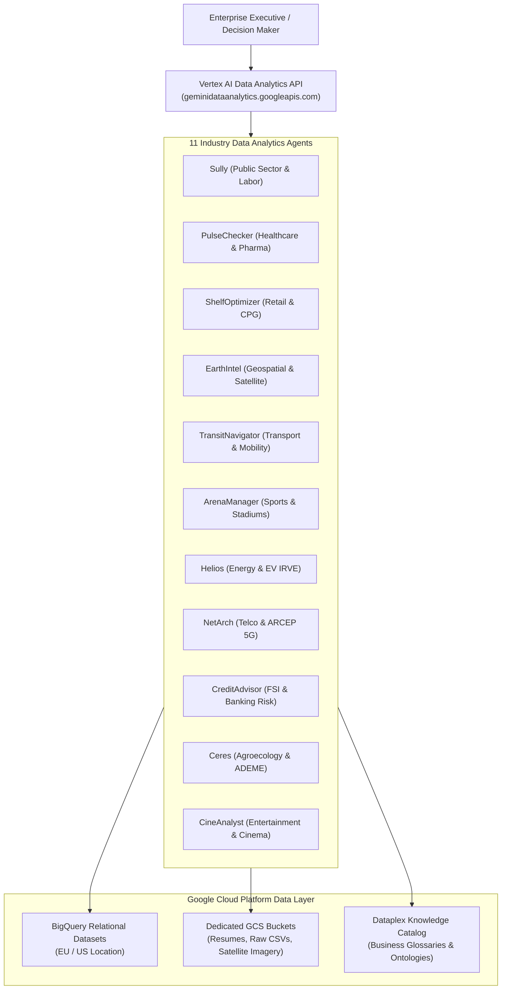

# TalkToData — Enterprise Multi-Agent Data Analytics Platform

**TalkToData** is an enterprise-grade, multi-agent AI data analytics platform deployed on **Google Cloud Platform (GCP)**. It integrates **GCP Vertex AI Data Agents** (`geminidataanalytics.googleapis.com`), **BigQuery** relational data warehouses, **Cloud Storage (GCS)** object buckets, **Dataplex Knowledge Catalog**, and authentic French & European **Open Data** across 11 key industries.

---

## 🎯 Executive Value Proposition & Major ROI

Modern enterprises operate in complex, multi-domain environments where decision-makers require instant, data-driven answers across finance, operations, supply chain, healthcare, retail, and sustainability.

**TalkToData** solves this by deploying specialized **AI Data Analytics Agents**—acting as 24/7 executive copilots. Each agent translates complex natural language queries into optimized BigQuery SQL, joins multi-table relational datasets, inspects GCS Cloud Storage media/documents, and enforces strict business governance rules **without exposing technical code to the user**.

### Key ROI Capabilities:
- **Instant Strategic Insights** : Query multi-billion-row BigQuery warehouses using natural business language in French or English.
- **Authentic Open Data Integration** : Built on real datasets from France Travail, SNCF, Enedis, ARCEP, Ministère des Sports, Banque de France, ADEME Agribalyse, CNC, FINESS, and ESA Copernicus Sentinel-2.
- **Multimodal Data Analysis** : Unifies structured tables, GCS Object Tables for satellite imagery (Sentinel-2), and 300 clean, standardized candidate PDF resumes on Cloud Storage.
- **Dataplex Knowledge Catalog Governance** : 100% metadata coverage—including Overviews, Data Owners/Stewards, Labels, Aspects, Data Quality Rules, and Fully Qualified Names (FQN).

---

## 🏗️ High-Level System Architecture



---

## 💼 Detailed Breakdown of the 11 Industry Data Agents

| Agent ID | Display Name | Industry Domain | Key Business Capabilities & Strategic ROI | BigQuery Dataset |
| :--- | :--- | :--- | :--- | :--- |
| `sully-agent` | **Sully** | Public Sector & Labor | Anticipates hiring tensions (BMO 2025), ROME 4.0 taxonomy (12,243 occupations), URSSAF employer audits (4,500 SIRENE establishments), ATS candidate matching, and tracks 300 clean PDF resumes on GCS (`gs://sully-candidate-resumes-data-agents`). | `public_sector_employment_ds` |
| `pulse-checker-agent` | **PulseChecker** | Healthcare & Pharma | Identifies medical deserts (RPPS), targets private clinic expansion (5-year EBITDA projection), prevents critical drug shortages (antibiotics, insulin), regulates ER capacity (Plans Blancs), and audits AMELI Open BIO expenses. | `public_sector_healthcare_ds` |
| `shelf-optimizer-agent` | **ShelfOptimizer** | Retail & CPG | Audits planogram compliance, eliminates visual shelf-outs, reduces fresh food waste (14-day expiry prediction), optimizes national vs private label margins, and reformulates Nutri-Score / NOVA ingredients. | `retail_cpg_optimization_ds` |
| `earthintel-agent` | **EarthIntel** | Satellite & Geospatial | Unifies GCS Object Tables & BigQuery for ESA Sentinel-2 imagery (10m resolution), flood/fire hazard scores, crop NDVI vegetation stress, HT powerline tree encroachment, and CSRD zero-deforestation verification. | `skywatch_aerospace_ds` |
| `transit-navigator-agent` | **TransitNavigator** | Transport & Mobility | Tracks traveler volume across 3,000+ SNCF stations, train punctuality/SLA, tap-in turnstile validations (`ST_GEOGPOINT`), Navigo/TER passenger commute profiles, and lost & found item resolution. | `transport_mobility_ds` |
| `arena-manager-agent` | **ArenaManager** | Sports & Stadiums | Maximizes stadium ticket sales & VIP hospitality suites, food/beverage concessions, audits sports facility energy waste (RES Ministry of Sports census), and evaluates ANS public grant impact on youth enrollment. | `sports_infrastructure_ds` |
| `helios-agent` | **Helios** | Power & EV Energy | Optimizes 10,000 Enedis EV charging stations (IRVE), monitors 30-min transformer load curves, renewable energy injection (solar/wind), and B2B industrial demand response. | `energy_utilities_ds` |
| `net-arch-agent` | **NetArch** | Telco & Media | Monitors ARCEP 4G/5G mobile coverage across 10,000 cell towers (Orange, SFR, Bouygues, Free), 3.5 GHz spectrum allocation, QoS latency, and automated NOC incident resolution. | `telecom_network_ds` |
| `credit-advisor-agent` | **CreditAdvisor** | FSI & Banking | Detects corporate insolvency risks before bankruptcy, aligns credit policies with Banque de France BLS surveys, models IFRS 9 ECL staging, and targets B2B upsell for resilient SMEs. | `financial_banking_ds` |
| `ceres-agent` | **Ceres** | Agriculture & ESG | Predicts weather-driven crop yield drops, models ADEME Agribalyse 3.1 ACV lifecycle environmental footprint, Low-Carbon Label credits, and certified ESG reporting for institutional investors. | `agriculture_rural_ds` |
| `cine-analyst-agent` | **CineAnalyst** | Entertainment & Cinema | Unifies CNC historical box-office series, theater ticket pricing, regional audience distribution, screen capacity, and movie production profitability. | `cinema_boxoffice_ds` |

---

## ⚡ Quickstart — 1-Click Installation & Deployment

Anyone cloning this repository can easily install, initialize datasets, download authentic Open Data, and deploy all 11 Data Agents on GCP.

### 1. Prerequisites
- **Python 3.10+** installed.
- **Google Cloud SDK (`gcloud`)** installed and authenticated.
- A GCP Project with **BigQuery**, **Cloud Storage**, and **Vertex AI Data Analytics API** enabled.

### 2. Installation & Setup Steps

```bash
# Step 1: Clone the repository
git clone https://github.com/ken-william/Data-Agents-By-Industry.git
cd Data-Agents-By-Industry

# Step 2: Set your GCP Project environment variable
export GOOGLE_CLOUD_PROJECT="your-gcp-project-id"

# Step 3: Authenticate with Google Cloud
gcloud auth login
gcloud auth application-default login

# Step 4: Create & activate virtual environment
python3 -m venv .venv
source .venv/bin/activate

# Step 5: Install Python dependencies
pip install -r requirements.txt

# Step 6: One-click download Open Data, build datasets, and deploy all 11 Vertex AI Data Agents
python deploy_all.py
```

---

## 📁 Repository Structure

```text
talktodata/
├── agents/                           # 11 Industry Data Analytics Agents
│   ├── README.md                     # Dedicated agent architecture & extension guide
│   ├── sully/                        # Sully - France Travail & Emploi Public
│   │   ├── generate_fresh_pdf_cvs.py # 300 PDF CV generator & GCS uploader
│   │   ├── ddl_setup.sql             # BigQuery schema definitions
│   │   ├── generate_data.py          # Data pipeline
│   │   ├── agent_payload.json        # Vertex AI Data Agent config
│   │   └── business_catalog_config.json # Dataplex Catalog metadata
│   ├── pulse_checker/                # PulseChecker - Santé & Hôpitaux
│   ├── shelf_optimizer/              # ShelfOptimizer - Merchandising Retail
│   ├── earth_intel/                  # EarthIntel - Imagerie Satellitaire
│   ├── transit_navigator/            # TransitNavigator - Transports & Mobilité
│   ├── arena_manager/                # ArenaManager - Sport & Stades
│   ├── helios/                       # Helios - Énergie & IRVE Enedis
│   ├── net_arch/                     # NetArch - Télécoms ARCEP
│   ├── credit_advisor/               # CreditAdvisor - Risque Crédit
│   ├── ceres/                        # Ceres - Transition Agroécologique
│   └── cine_analyst/                 # CineAnalyst - Box-Office Cinéma
├── download_authentic_opendata.py    # Centralized fetcher for official French Open Data
├── deploy_all.py                     # One-click master setup & deployment script
├── requirements.txt                  # Python dependencies
├── ARCHITECTURE.md                   # Detailed technical & relational schema specs
└── DEPLOYMENT.md                     # Step-by-step deployment guide
```

---

## 📚 Detailed Sub-Documentation

- [agents/README.md](file:///usr/local/google/home/theophanes/talktodata/agents/README.md) — Detailed agent directory specifications and guide to adding new Data Agents.
- [ARCHITECTURE.md](file:///usr/local/google/home/theophanes/talktodata/ARCHITECTURE.md) — Relational schema specs, Open Data provenance, and BigQuery table mapping.
- [DEPLOYMENT.md](file:///usr/local/google/home/theophanes/talktodata/DEPLOYMENT.md) — In-depth credential validation, API troubleshooting, and testing instructions.
