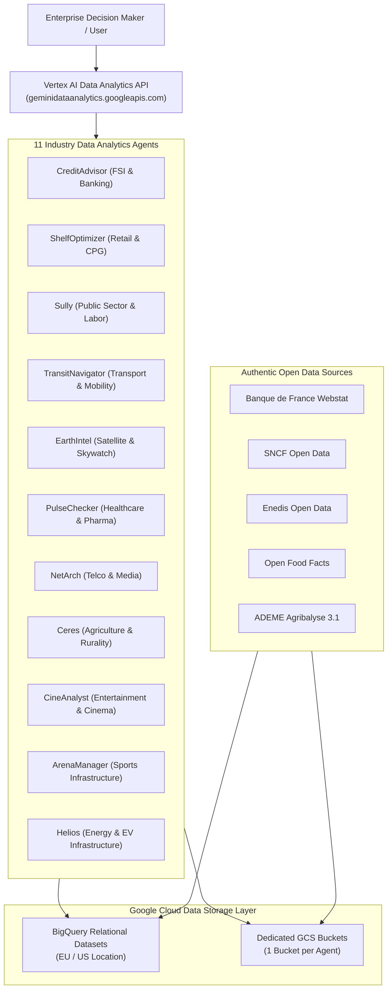

# TalkToData: Enterprise Multi-Agent Data Analytics Platform

TalkToData is a production-ready, multi-agent enterprise data analytics platform deployed on Google Cloud Platform (GCP). It integrates Google Cloud Vertex AI Data Analytics Agents (`geminidataanalytics.googleapis.com`), BigQuery relational data warehouses, Google Cloud Storage (GCS) raw data buckets, and authentic Open Data sources across 11 key industries.

---

## High-Level System Architecture



---

## Supported Industry Data Agents

| Agent ID | Industry Domain | BigQuery Dataset | Primary Capabilities |
| :--- | :--- | :--- | :--- |
| `credit-advisor-agent` | FSI & Banking | `fsi_creditadvisor_dataset` | Predicts corporate default risks, optimizes cash-flow loan upsell, models IFRS 9 staging, RAROC, and macroeconomic shock resilience. |
| `shelf-optimizer-agent` | Retail & CPG | `retail_cpg_ds` | Analyzes Open Food Facts catalog, product pricing, Nutri-Score distribution, and basket margin optimization. |
| `sully-agent` | Public Sector & Labor | `public_sector_employment_ds` | Analyzes France Travail BMO recruitment tension, job openings, candidate matching, and regional employment dynamics. |
| `transit-navigator-agent` | Transport & Mobility | `transport_mobility_ds` | Tracks authentic SNCF station traveler counts, train punctuality, line regularity, lost objects, and ticketing validations. |
| `earth-intel-agent` | Satellite & Skywatch | `skywatch_aerospace_ds` | Processes Sentinel-2 satellite metadata, optical bands, vegetation indices (NDVI), and industrial asset monitoring. |
| `pulse-checker-agent` | Healthcare & Pharma | `healthcare_pharma_ds` | Analyzes RPPS physician density, hospital capacity, AMELI Open Bio biology statistics, and medical desert identification. |
| `net-arch-agent` | Telco & Media | `telco_media_ds` | Monitors ARCEP 4G/5G cell tower coverage, fiber optic deployment, network traffic flows, and user signal complaints. |
| `ceres-agent` | Agriculture & Rurality | `agriculture_rurality_ds` | Evaluates ADEME Agribalyse 3.1 ACV lifecycle environmental impact, summer weather forecast anomalies, low-carbon labels, and ESG reports. |
| `cine-analyst-agent` | Entertainment & Cinema | `entertainment_cinema_ds` | Analyzes CNC box office results, theater seat distribution, film subsidies, market share, and box office flops. |
| `arena-manager-agent` | Sports Infrastructure | `sports_infrastructure_ds` | Tracks Ministry of Sports facility distribution, sports licenses by region, regional imbalances, and public grants. |
| `helios-agent` | Power & EV Infrastructure | `power_energy_ds` | Monitors authentic Enedis IRVE electric charging stations, industrial power demand, and renewable energy production. |

---

## Directory Layout

```text
talktodata/
├── agents/
│   ├── credit_advisor/
│   ├── shelf_optimizer/
│   ├── sully/
│   ├── transit_navigator/
│   ├── earth_intel/
│   ├── pulse_checker/
│   ├── net_arch/
│   ├── ceres/
│   ├── cine_analyst/
│   ├── arena_manager/
│   └── helios/
│       ├── ddl_setup.sql          # BigQuery DDL table schema definitions
│       ├── generate_data.py       # Relational data pipeline & generator
│       ├── agent_payload.json     # Data Analytics Agent configuration payload
│       ├── deploy_agent.py        # Python deployment script for GCP Data Analytics API
│       └── data/                  # Local workspace directory for authentic CSV files
├── download_authentic_opendata.py # Automated fetcher for official French Open Data APIs
├── deploy_all.py                  # One-click master deployment script
├── requirements.txt               # Python package dependencies
├── .gitignore                     # Git exclusion rules
├── ARCHITECTURE.md                # Comprehensive data architecture documentation
└── DEPLOYMENT.md                  # Complete deployment and execution guide
```

---

## Quickstart

### Prerequisites
1. Python 3.10+ installed.
2. Google Cloud SDK (`gcloud`) installed and authenticated.
3. A GCP project with BigQuery, Cloud Storage, and Vertex AI Data Analytics API enabled.

```bash
# 1. Clone the repository
git clone <repository-url>
cd talktodata

# 2. Set your GCP project environment variable
export GOOGLE_CLOUD_PROJECT="your-gcp-project-id"

# 3. Authenticate with Google Cloud
gcloud auth login
gcloud auth application-default login

# 4. Install dependencies
pip install -r requirements.txt

# 5. Execute master deployment script
python deploy_all.py
```

---

## Documentation

* [ARCHITECTURE.md](file:///usr/local/google/home/theophanes/talktodata/ARCHITECTURE.md): Detailed relational schema design, Open Data provenance, and API specs.
* [DEPLOYMENT.md](file:///usr/local/google/home/theophanes/talktodata/DEPLOYMENT.md): Step-by-step deployment, credential verification, and testing instructions.
